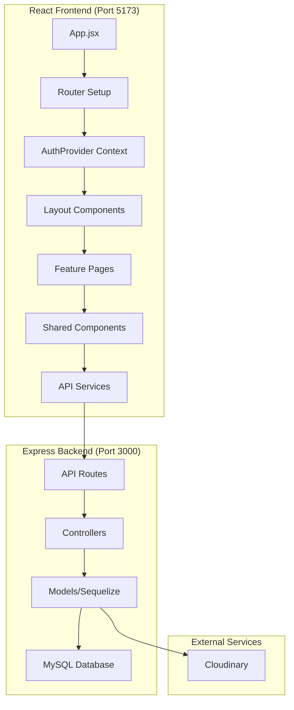
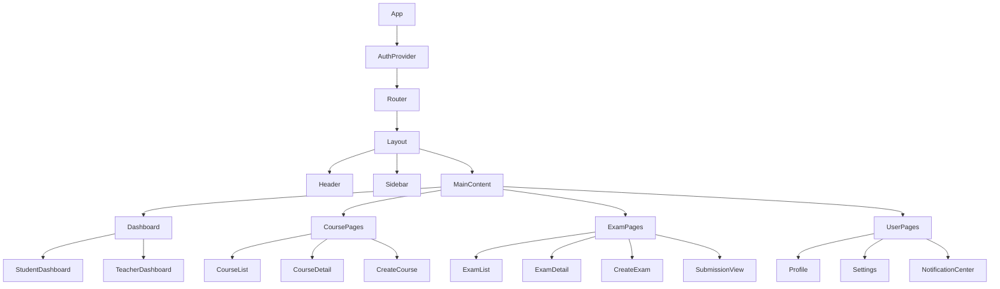
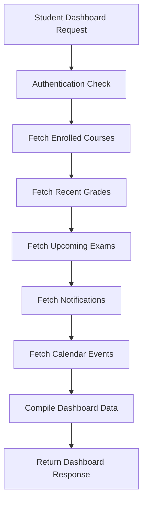
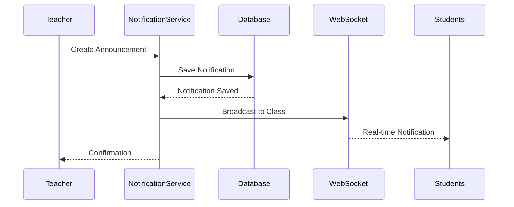
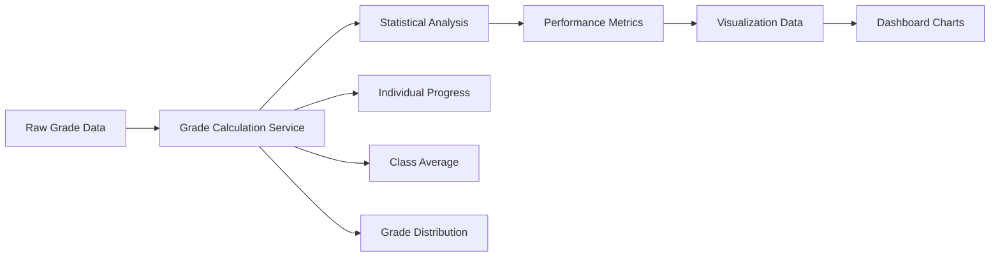

# Feature Analysis and ReactJS Migration Implementation

## Overview

This design document outlines the comprehensive enhancement of the edu_web_dev school management application by migrating from Handlebars server-side rendering to a modern ReactJS frontend while implementing missing critical features. The current application provides basic functionality for student/teacher authentication, course management, and exam submission, but lacks several essential features for a complete school management system.

## Technology Stack & Dependencies

### Current Backend Stack
- **Express.js 5.1.0** - Web framework
- **Sequelize 6.37.7** - ORM for MySQL/SQLite
- **Node.js** - Runtime environment
- **Cloudinary 2.6.0** - Media storage
- **bcrypt 5.1.1** - Password hashing

### New Frontend Stack
- **React 18.x** - UI library using JSX
- **React Router 6.x** - Client-side routing
- **Axios** - HTTP client for API calls
- **React Hook Form** - Form handling
- **React Query/TanStack Query** - Server state management
- **Material-UI (MUI) or Tailwind CSS** - UI components and styling
- **React Context/Zustand** - Global state management

### Build Tools
- **Vite** - Fast build tool and dev server
- **ESLint & Prettier** - Code quality tools

## Architecture

### Frontend Architecture



### Component Hierarchy



## Missing Features Analysis

### Current Feature Status

| Feature Category | Current Status | Missing Components |
|------------------|----------------|-------------------|
| **Student Dashboard** | ❌ Missing | Complete student homepage, course overview, notifications |
| **Notification System** | ❌ Missing | Real-time notifications, notification center |
| **Grade Management** | ⚠️ Partial | Student grade viewing, grade analytics |
| **Calendar System** | ❌ Missing | Academic calendar, exam schedules, personal calendar |
| **File Management** | ⚠️ Partial | Document library, file sharing, version control |
| **Communication** | ❌ Missing | Messaging system, announcements |
| **Admin Panel** | ❌ Missing | System administration, user management |
| **Reporting** | ❌ Missing | Performance analytics, attendance tracking |
| **Mobile Responsiveness** | ⚠️ Partial | Full mobile optimization |

### Critical Missing Features

1. **Student-Specific Dashboard**
2. **Comprehensive Notification System** 
3. **Calendar and Scheduling**
4. **Advanced Grade Analytics**
5. **File Management System**
6. **Real-time Communication**
7. **Admin Management Panel**
8. **Mobile-First Design**

## API Endpoints Reference

### Authentication & User Management
```
POST   /api/auth/login           - Student login
POST   /api/auth/teacher-login   - Teacher login  
POST   /api/auth/signup          - Student registration
POST   /api/auth/logout          - Session termination
GET    /api/auth/me              - Current user info
PUT    /api/auth/profile         - Update profile
```

### Student-Specific Endpoints
```
GET    /api/student/dashboard         - Student dashboard data
GET    /api/student/courses           - Enrolled courses
GET    /api/student/grades            - Grade overview
GET    /api/student/notifications     - User notifications
GET    /api/student/calendar          - Personal calendar
POST   /api/student/course/enroll     - Course enrollment
```

### Course Management
```
GET    /api/courses                   - Course listing (role-based)
GET    /api/courses/:id               - Course details
POST   /api/courses                   - Create course (teacher)
PUT    /api/courses/:id               - Update course (teacher)
DELETE /api/courses/:id               - Delete course (teacher)
GET    /api/courses/:id/students      - Enrolled students
```

### Exam System
```
GET    /api/exams                     - Exam listing
GET    /api/exams/:id                 - Exam details
POST   /api/exams                     - Create exam (teacher)
PUT    /api/exams/:id                 - Update exam (teacher)
POST   /api/exams/:id/submit          - Submit exam (student)
GET    /api/exams/:id/submissions     - View submissions (teacher)
```

### Notification System  
```
GET    /api/notifications             - User notifications
POST   /api/notifications             - Create notification
PUT    /api/notifications/:id/read    - Mark as read
DELETE /api/notifications/:id         - Delete notification
```

### File Management
```
POST   /api/files/upload              - File upload
GET    /api/files/:id                 - Download file
DELETE /api/files/:id                 - Delete file
GET    /api/files/course/:courseId    - Course files
```

## Data Models & ORM Mapping

### New Models Required

#### Notification Model
```javascript
const Notification = sequelize.define('Notification', {
  notification_id: { type: DataTypes.INTEGER, primaryKey: true },
  user_id: { type: DataTypes.INTEGER, allowNull: false },
  user_type: { type: DataTypes.ENUM('student', 'teacher'), allowNull: false },
  title: { type: DataTypes.STRING(255), allowNull: false },
  message: { type: DataTypes.TEXT, allowNull: false },
  type: { type: DataTypes.ENUM('info', 'warning', 'success', 'error'), defaultValue: 'info' },
  is_read: { type: DataTypes.BOOLEAN, defaultValue: false },
  created_at: { type: DataTypes.DATE, defaultValue: DataTypes.NOW }
});
```

#### Calendar Event Model
```javascript
const CalendarEvent = sequelize.define('CalendarEvent', {
  event_id: { type: DataTypes.INTEGER, primaryKey: true },
  title: { type: DataTypes.STRING(255), allowNull: false },
  description: { type: DataTypes.TEXT },
  start_date: { type: DataTypes.DATE, allowNull: false },
  end_date: { type: DataTypes.DATE, allowNull: false },
  event_type: { type: DataTypes.ENUM('exam', 'class', 'deadline', 'holiday') },
  class_id: { type: DataTypes.INTEGER, references: { model: 'classes', key: 'class_id' } }
});
```

#### File Management Model
```javascript
const File = sequelize.define('File', {
  file_id: { type: DataTypes.INTEGER, primaryKey: true },
  filename: { type: DataTypes.STRING(255), allowNull: false },
  original_name: { type: DataTypes.STRING(255), allowNull: false },
  file_url: { type: DataTypes.TEXT, allowNull: false },
  file_size: { type: DataTypes.INTEGER },
  mime_type: { type: DataTypes.STRING(100) },
  uploaded_by: { type: DataTypes.INTEGER, allowNull: false },
  uploader_type: { type: DataTypes.ENUM('student', 'teacher'), allowNull: false },
  class_id: { type: DataTypes.INTEGER, references: { model: 'classes', key: 'class_id' } }
});
```

### Enhanced Existing Models

#### Student Model Enhancements
```javascript
// Additional fields to add:
phone: { type: DataTypes.STRING(20) },
date_of_birth: { type: DataTypes.DATE },
profile_picture: { type: DataTypes.TEXT },
last_login: { type: DataTypes.DATE },
is_active: { type: DataTypes.BOOLEAN, defaultValue: true }
```

#### Class Model Enhancements  
```javascript
// Additional fields to add:
start_date: { type: DataTypes.DATE },
end_date: { type: DataTypes.DATE },
max_students: { type: DataTypes.INTEGER, defaultValue: 50 },
is_active: { type: DataTypes.BOOLEAN, defaultValue: true }
```

## Business Logic Layer

### Student Dashboard Service


### Notification Service


### Grade Analytics Service


## Middleware & Interceptors

### CORS Configuration
```javascript
const corsOptions = {
  origin: ['http://localhost:5173', 'http://localhost:3000'],
  credentials: true,
  methods: ['GET', 'POST', 'PUT', 'DELETE'],
  allowedHeaders: ['Content-Type', 'Authorization']
};
```

### API Validation Middleware
```javascript
const validateRequest = (schema) => (req, res, next) => {
  const { error } = schema.validate(req.body);
  if (error) {
    return res.status(400).json({ 
      success: false, 
      message: error.details[0].message 
    });
  }
  next();
};
```

### Rate Limiting
```javascript
const rateLimit = require('express-rate-limit');
const apiLimiter = rateLimit({
  windowMs: 15 * 60 * 1000, // 15 minutes
  max: 100 // limit each IP to 100 requests per windowMs
});
```

## ReactJS Implementation Strategy

### Project Structure
```
frontend/
├── src/
│   ├── components/
│   │   ├── common/
│   │   ├── layout/
│   │   └── forms/
│   ├── pages/
│   │   ├── student/
│   │   ├── teacher/
│   │   └── auth/
│   ├── hooks/
│   ├── services/
│   ├── context/
│   ├── utils/
│   └── assets/
├── public/
└── package.json
```

### Component Design Patterns

#### Higher-Order Component for Authentication
```jsx
const withAuth = (WrappedComponent, requiredRole = null) => {
  return (props) => {
    const { user, loading } = useAuth();
    
    if (loading) return <LoadingSpinner />;
    if (!user) return <Navigate to="/login" />;
    if (requiredRole && user.role !== requiredRole) {
      return <Navigate to="/unauthorized" />;
    }
    
    return <WrappedComponent {...props} />;
  };
};
```

#### Custom Hooks for API Calls
```jsx
const useStudentDashboard = () => {
  return useQuery({
    queryKey: ['studentDashboard'],
    queryFn: async () => {
      const { data } = await api.get('/api/student/dashboard');
      return data;
    },
    refetchInterval: 5 * 60 * 1000 // 5 minutes
  });
};
```

### State Management Architecture

#### Context Providers
```jsx
// AuthContext for user authentication state
// NotificationContext for real-time notifications
// ThemeContext for UI theming
// ModalContext for modal management
```

#### Global State Structure
```javascript
const globalState = {
  auth: {
    user: null,
    isAuthenticated: false,
    loading: false
  },
  notifications: {
    unreadCount: 0,
    items: []
  },
  ui: {
    theme: 'light',
    sidebarOpen: true
  }
};
```

## Migration Strategy

### Phase 1: Backend API Development (Week 1-2)
1. Create new API endpoints
2. Add missing database models
3. Implement JWT authentication alongside sessions
4. Add CORS and API middleware
5. Create comprehensive API documentation

### Phase 2: React Application Setup (Week 2-3)
1. Initialize React project with Vite
2. Set up routing and authentication
3. Create base layout components
4. Implement API service layer
5. Set up state management

### Phase 3: Core Feature Implementation (Week 3-5)
1. Student dashboard
2. Teacher dashboard enhancement
3. Notification system
4. Calendar functionality
5. Enhanced course management

### Phase 4: Advanced Features (Week 5-6)
1. File management system
2. Grade analytics
3. Real-time communication
4. Mobile responsiveness
5. Admin panel

### Phase 5: Testing & Deployment (Week 6-7)
1. Component testing with React Testing Library
2. API testing with Jest/Supertest
3. Integration testing
4. Performance optimization
5. Production deployment

## API Integration Layer

### Axios Configuration
```javascript
const apiClient = axios.create({
  baseURL: process.env.REACT_APP_API_URL || 'http://localhost:3000',
  withCredentials: true,
  timeout: 10000
});

// Request interceptor for authentication
apiClient.interceptors.request.use(
  (config) => {
    const token = localStorage.getItem('authToken');
    if (token) {
      config.headers.Authorization = `Bearer ${token}`;
    }
    return config;
  },
  (error) => Promise.reject(error)
);
```

### Service Layer Pattern
```javascript
// services/studentService.js
export const studentService = {
  getDashboard: () => apiClient.get('/api/student/dashboard'),
  getCourses: () => apiClient.get('/api/student/courses'),
  enrollCourse: (courseData) => apiClient.post('/api/student/course/enroll', courseData),
  getGrades: () => apiClient.get('/api/student/grades')
};
```

## Routing & Navigation

### React Router Setup
```jsx
const AppRoutes = () => {
  return (
    <Routes>
      <Route path="/" element={<Layout />}>
        <Route index element={<Home />} />
        <Route path="login" element={<Login />} />
        <Route path="signup" element={<Signup />} />
        
        {/* Student Routes */}
        <Route path="student" element={<ProtectedRoute role="student" />}>
          <Route index element={<StudentDashboard />} />
          <Route path="courses" element={<CourseList />} />
          <Route path="courses/:id" element={<CourseDetail />} />
          <Route path="grades" element={<GradeView />} />
          <Route path="calendar" element={<Calendar />} />
          <Route path="profile" element={<Profile />} />
        </Route>
        
        {/* Teacher Routes */}
        <Route path="teacher" element={<ProtectedRoute role="teacher" />}>
          <Route index element={<TeacherDashboard />} />
          <Route path="courses" element={<CourseManagement />} />
          <Route path="courses/create" element={<CreateCourse />} />
          <Route path="exams" element={<ExamManagement />} />
          <Route path="management" element={<ClassManagement />} />
        </Route>
      </Route>
    </Routes>
  );
};
```

## Testing Strategy

### Unit Testing
- **React Components**: React Testing Library for component behavior
- **Custom Hooks**: Testing custom hooks with renderHook
- **Utility Functions**: Jest for pure function testing
- **API Services**: Mock API calls with MSW (Mock Service Worker)

### Integration Testing  
- **API Endpoints**: Supertest for Express route testing
- **Database Operations**: Test database with test-specific seeds
- **Authentication Flow**: End-to-end login/logout testing

### Component Testing Structure
```jsx
// StudentDashboard.test.jsx
describe('StudentDashboard', () => {
  it('displays enrolled courses', async () => {
    const mockCourses = [{ id: 1, name: 'Math 101' }];
    
    render(
      <QueryClient client={queryClient}>
        <StudentDashboard />
      </QueryClient>
    );
    
    await waitFor(() => {
      expect(screen.getByText('Math 101')).toBeInTheDocument();
    });
  });
});
```

## Performance Optimizations

### Code Splitting
```jsx
// Lazy loading for better performance
const StudentDashboard = lazy(() => import('./pages/StudentDashboard'));
const TeacherDashboard = lazy(() => import('./pages/TeacherDashboard'));

// Wrap with Suspense
<Suspense fallback={<LoadingSpinner />}>
  <StudentDashboard />
</Suspense>
```

### Caching Strategy
- **React Query**: Automatic caching and background updates
- **Service Worker**: Cache static assets and API responses
- **Browser Storage**: Local storage for user preferences

### Bundle Optimization
- **Tree Shaking**: Remove unused code
- **Code Splitting**: Route-based and component-based splitting  
- **Asset Optimization**: Image compression and lazy loading